# 🍓 Berry House

### Web & Writing for Independent Creators

*Fast, accessible JAMstack websites and thoughtful, effective writing.*

---

**Berry House** builds fast, accessible JAMstack websites and thoughtful, effective writing.  
We help independent creators, non-profits, and small teams communicate clearly and own their platform.

🌱 IndieWeb · 📡 RSS Ready · 🔒 Privacy First · ♿ Accessible

---

## 🎯 What We Do

### 🌐 Websites
Fast, accessible, and independent websites built with **Eleventy** and **Tailwind**. Own your platform and keep things simple.

- **Custom themes and brand systems** — Tailored designs that reflect your unique voice
- **Content migrations and SEO** — Smooth transitions with search visibility
- **Performance and accessibility audits** — Speed and inclusivity baked in

### ✍️ Writing
Clarity that converts. We help you say the right thing to the right people with editorial strategy and hands-on copy.

- **Website copy & information architecture** — Clear structure and compelling content
- **Articles, newsletters, and documentation** — Consistent voice across all channels
- **Editing, style guides, and governance** — Sustainable content practices

### 🎓 Education
Workshops and 1:1 sessions to build skills and confidence—publishing workflows, accessibility, and sustainable content.

- **IndieWeb and digital autonomy** — Take control of your online presence
- **Jamstack publishing workflows** — Modern, efficient content management
- **Accessible content practices** — Create for everyone

---

## 💡 Why Berry House?

<table>
<tr>
<td width="50%">

### 🧑‍🤝‍🧑 Human-Centered by Design
Content first, technology second. We prioritize clarity, accessibility, and longevity over trends.

</td>
<td width="50%">

### 🔓 Own Your Platform
No lock-in. Plain files, simple pipelines, and hosting you can move. Your content stays yours.

</td>
</tr>
<tr>
<td width="50%">

### ⚡ Accessible and Fast
Performance, semantic HTML, and inclusive writing baked in from day one—not bolted on later.

</td>
<td width="50%">

### 🌿 Calm, Sustainable Websites
Low overhead, low maintenance. You shouldn't need a team to publish or keep things running.

</td>
</tr>
</table>

---

## 🧭 Our Process

```mermaid
graph LR
    A[🔍 Discovery] --> B[🏗️ Structure]
    B --> C[⚙️ Build]
    C --> D[🚀 Launch & Teach]
    
    style A fill:#ffcccb
    style B fill:#ffffcc
    style C fill:#ccffcc
    style D fill:#ccccff
```

1. **🔍 Discovery** — Goals, audience, and constraints. We define success together.
2. **🏗️ Structure** — Information architecture, content model, and tone of voice.
3. **⚙️ Build** — Accessible templates, performance, and content workflows.
4. **🚀 Launch & Teach** — We ship, measure, and train your team to run with it.

---

## 🛠️ Tech Stack

Our projects are built with modern, sustainable technologies:

---

## 📚 Featured Projects

This organization hosts our open-source projects, starter templates, and learning resources:

- **Website Starters** — Pre-configured Eleventy templates for quick project starts
- **Accessibility Tools** — Resources and utilities for building inclusive web experiences
- **IndieWeb Guides** — Documentation and tutorials for owning your digital presence
- **Content Workflows** — Scripts and automation for sustainable publishing

> 💡 **Note:** Many of our client projects are private. Public repositories showcase our tools, templates, and educational resources.

---

## 🌟 Core Values

### 🌱 IndieWeb Principles
We believe in:
- **Owning your data** — Your content belongs to you
- **Publishing on your own domain** — Independence from platforms
- **POSSE** (Publish on your Own Site, Syndicate Elsewhere) — Own the canonical version
- **Longevity over trends** — Build things that last

### ♿ Accessibility First
Every project we build:
- Meets or exceeds **WCAG 2.1 AA** standards
- Uses semantic HTML and proper ARIA labels
- Tests with real assistive technologies
- Prioritizes keyboard navigation and screen reader support

### 🔒 Privacy & Ethics
- No tracking or analytics without consent
- Minimal third-party dependencies
- Privacy-respecting design patterns
- Transparent about data practices

---

## 📖 Recent Blog Posts

Stay updated with our latest insights on web development, IndieWeb practices, and content strategy:

- **[Berry House is Open for Business 🍓](https://berryhouse.ca/blog/berry-house-is-open/)** — Nov 01, 2025
- **[IndieWeb 101 and Making Your Site Delightfully Weird](https://berryhouse.ca/blog/indieweb-weird-retro-guide/)** — Aug 22, 2025
- **[Fixing Tags, Categories, and RSS in Our Eleventy Blog](https://berryhouse.ca/blog/fixing-tags-categories-feed/)** — Aug 19, 2025
- **[Guide to Making It as an Indie Creator](https://berryhouse.ca/blog/guide-to-making-it-as-an-indie-creator/)** — Aug 19, 2025

[📖 View all posts →](https://berryhouse.ca/blog/)

---

## 🤝 Contributing

We welcome contributions to our open-source projects! Here's how you can help:

1. **Fork the repository** you want to contribute to
2. **Create a feature branch** (`git checkout -b feature/amazing-feature`)
3. **Commit your changes** (`git commit -m 'Add some amazing feature'`)
4. **Push to the branch** (`git push origin feature/amazing-feature`)
5. **Open a Pull Request**

Please read our contributing guidelines in each repository before submitting.

---

## 📬 Get in Touch

We'd love to hear from you! Whether you're interested in working together or just want to say hello:

---

## 📄 License

- **Code:** [MIT License](https://opensource.org/license/mit) — Free to use, modify, and distribute
- **Content:** [CC BY-NC-SA 4.0](https://creativecommons.org/licenses/by-nc-sa/4.0/) — Share and adapt with attribution, non-commercial

---

### Let's build something that lasts 🍓

Made with ❤️ in Calgary, Alberta, Canada

[🌐 Visit Berry House](https://berryhouse.ca) · [📡 Subscribe to RSS](https://berryhouse.ca/feed.xml) · [🗂️ View Portfolio](https://berryhouse.ca/portfolio/)

---

*© 2025 Berry House — Empowering independent creators, one site at a time*
